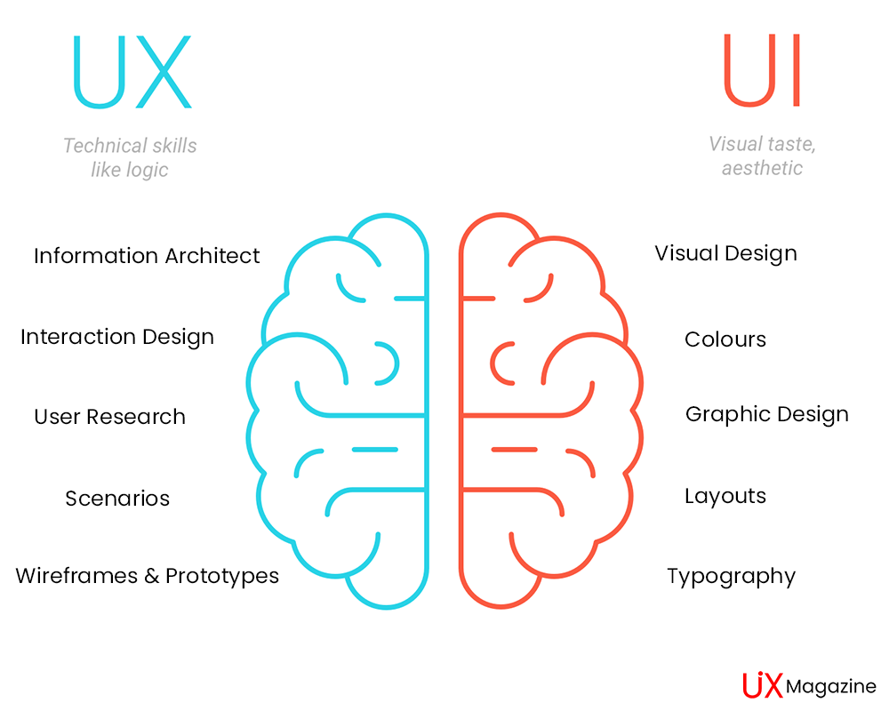

# UI(User Interface, 사용자 인터페이스)

---

- 사람들이 컴퓨터와 상호 작용하는 시스템
- 화면상의 그래픽 요소 외에도, 키보드, 마우스 등의 물리적 요소도 UI라고 볼 수 있다.
- 현대 사회에서는 GUI(Graphical User Interface)가 중요한 역할을 하게 되었다.

 

## GUI(Graphical User Interface, 그래픽 사용자 인터페이스)

- 사용자가 그래픽을 통해 컴퓨터와 정보를 교환하는 작업 환경
- 프론트엔드 개발자로서의 UI는 대부분 GUI를 의미한다.

    

# UX(User Experience, 사용자 경험)

---

- 사용자가 어떤 시스템, 제품, 서비스를 직·간접적으로 이용하면서 느끼고 생각하는 총체적 경험
- 제품, 서비스 그 자체에 대한 경험은 물론, 홍보, 접근성, 사후 처리 등 직·간접적으로 관련된 모든 경험을 사용자 경험이라고 할 수 있다.

    

# UI와 UX의 관계

---

- UI와 UX는 긴밀한 관계를 가지고 있지만, 서로 다른 작업을 수행하는 완전히 다른 역할이다.
- `UI`는 사물이 보이는 방식이고, `UX`는 사물이 작동하는 방식이다. **사용자 경험은 프로세스이고 사용자 인터페이스는 결과물이다.**
- UX는 UI를 포함하는 개념이다.
  - 좋은 UX가 좋은 UI를 의미하거나, 좋은 UI가 항상 좋은 UX를 보장하진 않는다. 그러나 나쁜 UI는 보통 나쁜 UX를 유발한다.

    

# 참고

---

[What are the Differences Between UI Design & UX Design?](https://uiuxmagazine.com/what-are-the-differences-between-ui-design-ux-design/)
