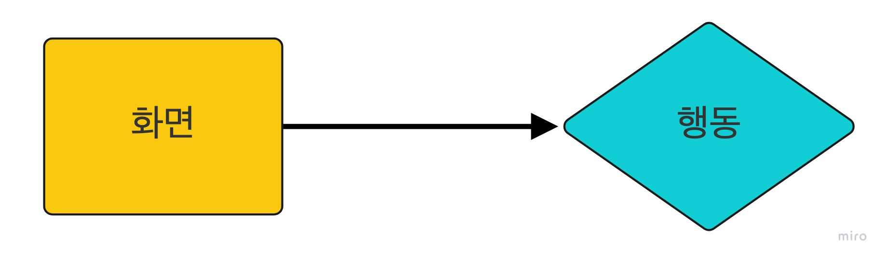

# 좋은 UX를 만드는 요소

---

## Peter Moville’s UX Honeycomb

- `피터 모빌(Peter Moville)의 벌집 모형`: UX의 7가지 필수 측면을 요약한 고전적인 UX 다이어그램

  

### 1. 유용성(Useful): 사용 가능한가?

- 제품이나 서비스가 목적에 맞는, 사용 가능한 기능을 제공하고 있는가에 관한 요소

 

### 2. 사용성(Usable): 사용하기 쉬운가?

- 제품이 본연의 기능을 제공하는 것을 넘어서 사용하기 쉬운가에 관한 요소
- 사용자가 원하는 페이지에 도달하는 데 몇 번의 클릭이 필요한가 등 최종 목표를 효과적이고 효율적으로 달성하는 사용자의 능력과 관련된다.
- 이 요소는 UI 디자인 패턴과도 연관이 깊다. 자주 쓰이는 패턴들은 사용자들에게도 친숙할 가능성이 높아 사용성을 높여준다.

 

### 3. 매력성(Desirable): 매력적인가?

- 제품이 사용자들에게 매력적인가에 대한 요소
- 애플이 제품의 디자인 요소에 공을 들이고 감성 마케팅 전략을 사용한 것이 이 요소와 연관이 깊다.

 

### 4. 신뢰성(Credible): 신뢰할 수 있는가?

- 윤리, 내구성 및 정확성 측면에서 사용자가 제품이나 서비스를 믿고 사용할 수 있는가에 관한 요소
- 스포티파이, 넷플릭스와 같은 회사는 원활한 스트리밍 경험을 약속한다. 만약 지속적으로 서비스 제공에 실패할 경우 사용자들은 다른 회사로 이동하게 된다.

 

### 5. 접근성(Accessible): 접근하기 쉬운가?

- 나이, 성별, 장애 여부를 떠나서 누구든지 제품이나 서비스에 접근할 수 있는가에 관한 요소

 

### 6. 검색 가능성(Findable): 찾기 쉬운가?

- 사용자가 원하는 기능이나 정보를 쉽게 찾을 수 있는가에 관한 요소
- 웹 사이트의 경우 사용자가 특정 페이지에 접근하려고 할 때 찾기 힘들다면 좋은 UX를 주기 어렵다.
- 내비게이션바, 정보 검색 기능을 넣거나 콘텐츠를 직관적으로 배치하는 것이 검색 가능성을 높이는 데 도움이 된다.

 

### 7. 가치성(Valuable): 가치를 제공하는가?

- 모든 요소들을 총합하여 고객에게 가치를 제공하고 있는가에 관한 요소

    

# User Flow

---

- 사용자 흐름(user flow)은 사용자가 제품에 진입한 시점을 시작으로 취할 수 있는 모든 행동을 뜻하며, 보통 다이어그램을 그려서 정리한다.

 

## User Flow 다이어그램 작성법

- 사용자 흐름을 다이어그램으로 작성할 때, 기본적으로 세 가지 요소를 사용한다.
  1. **직사각형**: 사용자가 보게 될 `화면`(ex. 회원 가입 페이지, 로그인 페이지)
  2. **다이아몬드**: 사용자가 취하게 될 `행동`(ex. 로그인, 버튼 클릭, 업로드)
  3. **화살표**: 직사각형과 다이아몬드를 연결시켜주는 화살표

  

## User Flow 다이어그램을 그리면 좋은 이유

1. 사용자 흐름 상 어색하거나 매끄럽지 않은 부분을 발견하여 수정할 수 있다.
2. 있으면 좋은 기능을 발견하여 추가하거나 없어도 상관 없는 기능을 발견하고 삭제할 수 있다.

   → User Flow 다이어그램을 그리면서 사용자 흐름을 빈틈 없이, 보다 더 편리하게 다듬어 나가는 과정을 거치면 `UX를 개선`할 수 있다.

    

# 참고

---

[코드스테이츠 프론트엔드 부트캠프](https://www.codestates.com/)

[User Experience Design](http://semanticstudios.com/user_experience_design/)

[The UX Honeycomb: Seven Essential Considerations for Developers](https://medium.com/mytake/the-ux-honeycomb-seven-essential-considerations-for-developers-accc372a398c)
