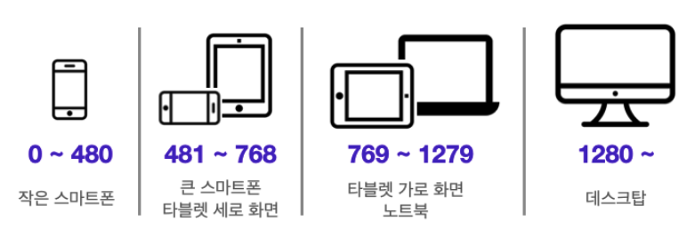

# UI 디자인 패턴

---

## 모달(Modal)

- 기존에 이용하던 화면 위에 오버레이 되는 창
- 사용자의 현재 작업을 중단하여 더 중요한 것에 사용자의 관심을 집중시키려는 경우 사용한다.
- 팝업은 브라우저에 의해 강제로 막힐 수 있지만, 모달은 브라우저 설정에 영향을 받지 않아, 꼭 보여주고 싶은 내용이 있다면 모달을 사용하는 것이 좋다.

  

## 토글(Toggle)

- On/Off를 설정할 때 사용하는 스위치 버튼
- 보통 두 개의 옵션이 있을 때 사용하며, 색상, 스위치의 위치, 그림자 등의 시각적 효과를 주어 사용자가 토글의 상태를 직관적으로 알 수 있게 만들어야 한다.

  

## 탭(Tab)

- 콘텐츠를 섹션으로 분리해야할 때 사용한다.
- 각 탭의 내용이 유사한 구조를 가지고 있으며, 페이지 새로 고침을 우회하여 사용자의 관심을 유지해야할 때 사용한다.

  

## 태그(Tag)

- 콘텐츠를 설명하는 키워드를 사용해서 라벨을 붙이는 역할
- 콘텐츠를 분류하거나, 관련 콘텐츠들만 검색할 수 있게 한다.
- 태그의 추가와 제거는 자유롭게 할 수 있어야 한다.

  

## 자동완성(Autocomplete)

- 사용자가 내용을 입력 중일 때 사용자가 입력하고자 하는 내용과 일치할 가능성이 높은 항목을 보여주는 것
- 자동완성 항목은 너무 많은 항목이 나오지 않도록 개수를 제한하는 것이 좋으며, 키보드 방향키나 클릭 등으로 접근하여 사용할 수 있는 것이 좋다.

  

## 드롭다운(Dropdown)

- 선택할 수 있는 항목들을 숨겨놓았다가, 펼쳐지면서 선택할 수 있게 해주는 UI 디자인 패턴
- 공간 절약을 위해 사용한다.

  

## 아코디언(Accordion)

- 접었다 폈다 할 수 있는 컴포넌트로, 보통 같은 분류의 아코디언을 여러 개 연속해서 배치한다.
- 기본적으로 화면을 깔끔하게 구성하기 위해서 사용하며, 트리 구조나 메뉴바로 사용할 경우에는 상하 관계를 표현하기 위해서 사용하는 경우가 많고, 콘텐츠를 담는 용도로 사용할 때에는 핵심 내용을 먼저 전달하려는 목적을 가질 때가 많다.

  

## 캐러셀(Carousel)

- 컨베이어 벨트나 회전목마처럼 빙글빙글 돌아가면서 콘텐츠를 표시해 주는 UI 디자인 패턴
- 표시할 항목이 많지만 사용자가 한 번에 몇 가지 항목에만 주의를 집중할 수 있도록 하려는 경우에 사용한다.
- 영화 포스터, 앨범 표지, 제품 등과 같이 시각적인 항목을 표시할 때 사용한다.
- 자동으로 돌아가거나, 사용자가 옆으로 넘겨야만 넘어가게 만들 수 있다.

  

## 페이지네이션(Pagination)

- 한 페이지에 띄우기에 정보가 너무 많은 경우, 책 페이지를 넘기듯이 번호를 붙여 페이지를 구분해주는 것
- 페이지를 넘기기 위해서는 잠시 멈춰야 하기 때문에 매끄러운 사용자 경험과는 거리가 멀 수 있다는 단점도 있다.

  

## 무한 스크롤(Infinite Scroll, Continuous Scroll)

- 모든 콘텐츠를 불러올 때까지 무한으로 스크롤을 내릴 수 있는 것
- 페이지네이션과 마찬가지로 한 번에 띄우기엔 정보가 너무 많을 때 사용
- 페이지네이션보다 매끄러운 사용자 경험을 제공하지만, 콘텐츠의 끝이 어딘지 알 수 없다는 점, 지나친 콘텐츠를 찾기 힘들다는 점 등의 단점도 있다.
- 보통 페이지의 맨 아래에 도달하면 추가 콘텐츠를 로드해오는 방식으로 만든다.

  

## GNB(Global Navigation Bar), LNB(Local Navigation Bar)

- GNB는 어느 페이지에 들어가든 사용할 수 있는 최상위 메뉴, LNB는 GNB에 종속되는 서브 메뉴 또는 특정 페이지에서만 볼 수 있는 메뉴를 뜻한다.

    

# UI 레이아웃

---

## 그리드 시스템(Grid System)

- 그리드(Grid)는 수직, 수평으로 분할된 격자무늬를 뜻하며, 말 그대로 화면을 격자로 나눈 다음 그 격자에 맞춰 콘텐츠를 배치하는 방법
- 웹 디자인 분야에서는 화면을 세로로 몇 개의 영역으로 나눌 것인가에 초점을 맞춘 컬럼 그리드 시스템(Column Grid System)을 사용하며, Margin, Column, Gutter라는 세 가지 요소로 구성된다.

  

### 1. Column

- 콘텐츠가 위치하게 될 세로로 나누어진 영역
- 일반적으로 `휴대폰에서 4개`, `태블릿에서 8개`, `PC에서 12개`의 컬럼으로 나눈다.
- 각 디바이스의 화면 크기는 보통 아래 이미지와 같으며, 이미지 속 화면 크기의 구분선을 break point라고 한다.
  
- 컬럼은 상대 단위를 사용하여 콘텐츠가 창 크기에 맞춰서 크기가 변하도록 설정하는 것이 좋다.

 

### 2. Gutter

- Column 사이의 공간으로, 콘텐츠를 구분하는데 도움을 준다.
- Gutter의 간격이 좁을수록 콘텐츠들이 연관성 있어 보이고, 넓을수록 각 콘텐츠가 독립적인 느낌을 준다.
- Gutter는 아무리 넓어도 컬럼 너비보다는 작게 설정해야 한다.

 

### 3. Margin

- 화면 양쪽의 여백

    

# 참고

---

[Design patterns](https://ui-patterns.com/patterns)

[Responsive layout grid](https://material.io/design/layout/responsive-layout-grid.html)
