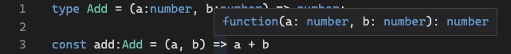
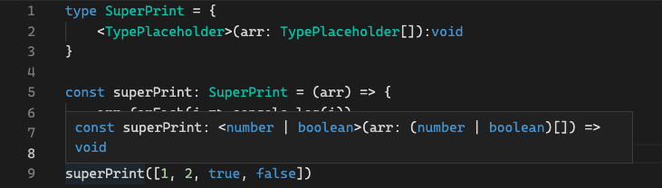

# 3.0 Call Signatures

---

## call signatures

- 함수 위에 마우스를 올렸을 때 보이는, 함수 인자의 타입과 반환 값의 타입을 지정하는 문법이다.

  ```tsx
  // call signature를 사용해 함수 타입 지정
  type Add = (a: number, b: number) => number;

  const add: Add = (a, b) => a + b;
  ```

  

<br /><br /><br /><br />

# 3.1 Overloading

---

## 오버로딩

- 하나의 함수가 **서로 다른 여러개의 call signature를 가질 때** 발생한다.

  ```tsx
  type Add = {
    (a: number, b: number): number;
    (a: number, b: string): number;
  };

  const add: Add = (a, b) => {
    // 매개변수 데이터 타입이 다른 경우 예외처리를 해야 한다.
    if (typeof b === "string") return a;
    return a + b;
  };
  ```

  ```tsx
  type Add = {
    // 파라미터 개수가 다른 경우 추가 파라미터는 선택사항(옵션)
    (a: number, b: number): number;
    (a: number, b: number, c: number): number;
  };

  // c 파라미터는 옵션이라는 것을 알려주고, 추가적으로 타입을 적어줘야 한다.
  const add: Add = (a, b, c?: number) => {
    // 파라미터의 개수가 다른 경우 예외 처리를 해야 한다.
    if (c) return a + b + c;
    return a + b;
  };
  ```

<br />

- Next.js에서 사용하는 예시

  ```tsx
  // Next.js에서 라우터를 이용해 페이지를 이동할 때
  // 1. string을 보내주거나
  Router.push("/home");

  // 2. object 형태로 다른 값을 추가로 담아 보내줄 수 있다.
  Router.push({
    path: "/home",
    state: 1,
  });

  // 패키지나 라이브러리를 디자인할 때
  // 아래와 같이 두 가지 경우의 오버로딩을 많이 사용한다.
  type Config = {
    path: string;
    state: object;
  };
  type Push = {
    (path: string): void;
    (config: Config): void;
  };

  const push: Push = (config) => {
    if (typeof config === "string") {
      console.log(config);
    } else {
      console.log(config.path);
    }
  };
  ```

<br /><br /><br /><br />

# 3.2 Polymorphism

## 다형성(Polymorphism)

- 파라미터와 반환값의 타입에 따라 여러 형태를 가진다.
  ```tsx
  // 다양한 경우를 커버하는 함수를 작성할 때
  // 모든 조합의 call signature를 concrete type으로 작성하면 번거롭다.
  type SuperPrint = {
    (arr: number[]): void;
    (arr: string[]): void;
    (arr: boolean[]): void;
    (arr: (number | string | boolean)[]): void;
  };
  ```

<br /><br />

## Generic

- 타입의 placeholder
- call signature를 작성할 때 확실한 타입을 모른다면 generic을 사용한다.

  ```tsx
  type SuperPrint = {
    // <> 괄호 안에 제네릭 이름을 넣는다.
    // 패키지나 라이브러리에서는 보통 T나 V를 사용한다.
    <TypePlaceholder>(arr: TypePlaceholder[]): TypePlaceholder;
  };

  const superPrint: SuperPrint = (arr) => arr[0];

  const a = superPrint([1, 2, 3, 4]);
  const b = superPrint([true, false, false]);
  const c = superPrint(["a", "b", "c"]);
  const d = superPrint([1, 2, true, false]);
  ```

<br />

- 제네릭을 사용하면 타입 스크립트가 추론한 타입으로 call signature를 만들어주기 때문에 보호받을 수 있다.
  

<br /><br /><br /><br />

# 3.3 Generics Recap

---

## generic과 any

```tsx
// 1. any를 사용할 경우
type SuperPrint = {
	(arr: any[]) => any
}

const superPrint: SuperPrint = (arr) => arr[0]

let a = superPrint([1, "b", true]);
// a.toUpperCase(1)이지만 에러가 발생하지 않는다.
a.toUpperCase(); //---> O

// 2. 제네릭을 사용할 경우
type SuperPrint = {
	<T>(arr: T[]) => T
}

const superPrint: SuperPrint = (arr) => arr[0]

let a = superPrint([1, "b", true]);
// Generic의 경우 에러가 발생해 보호받을 수 있다
a.toUpperCase(); //---> X
```

<br />

- 복수의 generic을 선언해 사용할 수 있다.

  ```tsx
  type SuperPrint = <T, V>(a: T[], b: V) => T;

  const superPrint: SuperPrint = (a) => a[0];

  const a = superPrint([1, 2, 3, 4], "x");
  ```

<br /><br /><br /><br />

# 3.4 Conclusions

---

- 라이브러리를 만들거나, 다른 개발자가 사용할 기능을 개발하는 경우엔 제네릭이 유용하다.
  - 그 외 대부분의 경우에 제네릭을 직접 작성할 일은 없다.

<br />

## 제네릭 사용 예시

- call signature 일반 함수로 대체

  ```tsx
  function superPrint<V>(a: V[]) {
    return a[0];
  }

  // 항상 타입스크립트가 타입을 유추하도록 하는 것이 좋다.
  const a = superPrint([1, 2, 3, 4]);
  // 경우에 따라서 더 구체적으로 하고 싶을 때, 직접 타입을 지정할 수 있다.
  // const a = superPrint<number>([1, 2, 3, 4])
  ```

<br />

- 제네릭을 사용하여 타입 커스텀 및 재사용이 가능하다.

  ```tsx
  type Player<E> = {
    name:string
    // extraInfo에는 어떤 타입이라도 올 수 있다.
    extraInfo:E
  }

  type HyejinExtra = {
    favFood:string
  }

  type HyejinPlayer = Player<HyejinExtra>

  const hyejin: HyejinPlayer = {
    name:"hyejin"
    extraInfo: {
      favFood:"kimchi"
    }
  }

  const lee: Player<null> = {
    name:"lee"
    extraInfo:null
  }
  ```

<br />

- Array도 제네릭을 받고 있다.

  ```tsx
  // Array<number> === number[]
  type A = Array<number>;

  let a: A = [1, 2, 3, 4];

  // function printAllNumbers(arr: number[]){}
  function printAllNumbers(arr: Array<number>) {}
  ```

<br />

- React.js의 useState 사용

  ```tsx
  // useState에서 제네릭을 사용하면 number 타입의 useState가 된다.
  useState<number>();
  ```

<br /><br /><br /><br />

# 참고

---

[타입스크립트로 블록체인 만들기](https://nomadcoders.co/typescript-for-beginners)
